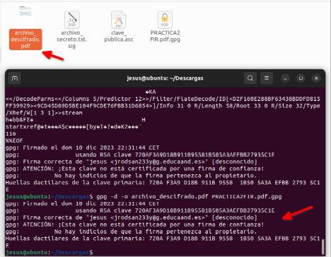
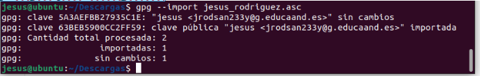
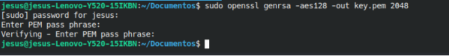

# seguridad Tema 4
# cifrado simetrico  GPG
## 1. Crea un documento de texto con cualquier editor o utiliza uno del que dispongas.
## 2. Cifra este documento con alguna contraseña acordada con el compañero de al lado.
Ciframos el documento con el comando **gpg -c “nombre del archivo”** y nos preguntara que contraseña queremos usar y a continuación se creará un **archivo .gpg** ese es el que debemos pasar al compañero.

 <p align="center">
    
</p>

## 3. Haz llegar por algún medio al compañero de al lado el documento que acabas de cifrar.
## 4. Descifra el documento que te ha hecho llegar tu compañero de al lado.
Para descifrar la contraseña usamos el comando **gpg -d “nombre del archivo”**.gpg 
nos pedira la contraseña y nos mostrará el contenido

 <p align="center">
    
</p>

## 5. ¿Con qué algoritmo se ha cifrado el fichero? Vuelve a cifrar el fichero usando el algoritmo AES256. ¿Puedes hacer permanente esta configuración?
Si escribimos el comando **gpg --list-packets archivo_cifrado.gpg** nos mostrara con que algoritmo se ha cifrado

 <p align="center">
    
</p>

en este caso ya se ha cifrado con **AES256**

si quisiéramos usar otro usaríamos el siguiente comando **gpg --cipher-algo cast5 -c archivo_secreto.txt**
siendo:
* --cipher-algo cast5: Especifica el algoritmo de cifrado simétrico que quieres utilizar (en este caso, cast5).

## 6. Instala gpg en windows (Gpg4win), repite el ejercicio en Windows. Puedes encriptar un mensaje en linux y desencriptarlo en windows y al contrario.

Una vez instalado ya podremos utilizar el programa para ello utilizaremos el archivo previamente cifrado con linux y lo descifraremos en windows con esta herramienta
el sistema ya reconoce que esta cifrado asi que le daremos click derecho y en descifrar y verificar e ingresaremos la contraseña

 <p align="center">
    
</p>
a continuación nos pedirá guardar el archivo nuevo descifrado y lo tendremos ya descifrado
<p align="center">
    
</p>
de la misma manera para cifrar lo haremos pulsando click derecho al archivo que queramos cifrar y nos aparecerá un asistente que nos ira pidiendo datos y la contraseña, una vez introduzcamos los datos ya tendremos el archivo cifrado 

<p align="center">
    
</p>

## 7. openssl es otra herramienta que nos permite cifrar mensajes de forma simétrica, investiga como se realiza este ejercicio utilizando esta herramienta.

Para instalar la aplicación de openssl iremos a la web [Win32/Win64 OpenSSL Installer for Windows - Shining Light Productions (slproweb.com)](https://slproweb.com/products/Win32OpenSSL.html)  y descargaremos la versión que queramos utilizar en mi caso usaré la .exe lite
y lo instalaremos de manera habitual como todos los programas de windows con doble clic con su asistente.

En el caso de no haber agregado la variable de entorno deberemos hacerlo en la configuración avanzada de Windows y añadir la ruta al path
<p align="center">
    
</p>
reinicia el sistema para que refresque las variables.
Una vez tengamos todo listo podremos cifrar con el siguiente comando remplazando archivo.txt por el archivo objetivo.

cifrar el archivo con la clave simétrica
openssl aes-128-cbc -in archivo.txt -out cifrado.enc
donde:
    • **aes-128-cbc** sería el protocolo utilizado mediante modo cbc (podemos utilizar otros tipos de cifrado mencionados en la ayuda del programa, como puede ser aes-256-cbc)
    • **-in: señala** el archivo a cifrar (archivo.txt)
    • **-out:** marcaría la salidad del archivo cifrado (cifrado.enc)
y nos pedirá la contraseña

<p align="center">
    
</p>
y para descifrarlo seria con el comando openssl aes-128-cbc -d -in cifrado.enc -out descifrado

donde:
    • **aes-128-cbc** es el tipo de cifrado
    • **-d** indica que vamos a descifrar
    • **-in:** nos marca el archivo cifrado (cifrado.enc)
    • **-out:** indica el nombre del archivo ya descifrado (descifrado o cualquier otro que elijáis)
<p align="center">
    
</p>

# Firma digital con gpg
## 1. Selecciona un documento pdf y encríptalo y fírmalo (opción –sign). Envíalo a un compañero, que debe en primer lugar verificar la firma y posteriormente descifrar el documento.
Cifraremos un archivo en este caso el mismo pdf de la practica
**gpg -c archivo.pdf**

 <p align="center">
    
</p>
una vez lo tengamos encriptado lo firmaremos.
Antes de hacer nada deberemos asegurarnos de que tenemos alguna clave privada con elsifuiente  comando

**gpg --list-secret-keys**
en el caso de no tener usariamos **gpg --gen-key** para generar una, te pedira el nombre real , un correo electronico  y escribir tu contraseña

una vez ya lo tengamos podemos proceder a firmar

para firmar  un documento lo haremos con el siguiente comando **gpg  --output archivo_firmado.gpg archivo_original.pdf**
el programa nos avisa de que ya hay un archivo con ese nombre y nos da la posibilidad de renombrarlo o machacarlo. 

 <p align="center">
    
</p>

Y ya tendremos el archivo firmado e encriptado
 <p align="center">
    
</p>

para verificar la firma usaremos el siguiente comando **gpg --verify archivo_firmado.gpg**

nos imprimirá en pantalla quien es el causante de esta firma entro otros datos como el **RSA**
 <p align="center">
    
</p>

tenemos que darle la clave publica a nuestro compañero lo haremos de la siguiente manera
gpg --export --armor [jrodsan233y@g.educaand.es](mailto:jrodsan233y@g.educaand.es) > clave_publica.asc
de esta manera exportamos las claves a un .asc con formato de salida ASCII que se lo daremos al compañero.

ahora el compañero debe agrega la clave a su llavero con el comando **gpg --import clave_publica.asc**
 <p align="center">
    
</p>

y lo descifraremos con la opcion -o para que genere un archivo nuevo con el resultado
**gpg -d -o archivo_descifrado.pdf PRACTICA2FIR.pdf.gpg**

 <p align="center">
    
</p>

## 2. Realiza el mismo ejercicio pero obteniendo una firma ASCII.
 Seguiremos los mismos pasos que anteriormente pero a la hora de exportar la clave usamos la opcion –armor
gpg --export --armor [jrodsan233y@g.educaand.es](mailto:jrodsan233y@g.educaand.es) > clave_publica.asc

## 3. Ahora sólo queremos firmar un documento. Firma un documento (opción --detach-sign). A continuación envía el documento original y la firma a un compañero para que verifique que el documento está firmado por tí.
Firmaremos el documento con el comando

**gpg --detach-sign documento.txt**

 <p align="center">
    
</p>

y le enviaremos el documento y la clave publica al compañero
importaremos la clave con **gpg --import clave_publica.asc**
y verificaremos la firma con el comando **gpg --verify documento.txt.asc documento.txt.gpg** 
o lo desencriptamos directamente
**gpg --decrypt archivo_secreto.txt.sig > documentodesencripta**
**do.txt**
 <p align="center">
    
</p>


# Integridad, firmas y autenticación

## Manda un documento y la firma electrónica del mismo a un compañero. Verifica la firma que tu has recibido.
Con este comando firmamos nuestro documento .gpg
gpg --sign firma2.pdf

 <p align="center">
    
</p>
verificamos la firma
**gpg --verify firma2.pdf.gpg**

 <p align="center">
    
</p>

## ¿Qué significa el mensaje que aparece en el momento de verificar la firma?

gpg: Firma correcta de "Pepe D <[josedom24@gmail.com](mailto:josedom24@gmail.com)>" [desconocido]
gpg: ATENCIÓN: ¡Esta clave no está certificada por una firma de confianza!
gpg: No hay indicios de que la firma pertenezca al propietario.
Huellas dactilares de la clave primaria: E8DD 5DA9 3B88 F08A DA1D 26BF 5141 3DDB 0C99 55FC

1. **"gpg: Firma correcta de 'Pepe D** [josedom24@gmail.com](mailto:josedom24@gmail.com)'": Este mensaje indica que la firma del archivo fue verificada con éxito. La firma pertenece al usuario con el nombre "Pepe D" y la dirección de correo electrónico "[josedom24@gmail.com](mailto:josedom24@gmail.com)".
    
2. **"gpg: ATENCIÓN: ¡Esta clave no está certificada por una firma de confianza!"**: Este mensaje indica que GPG no ha establecido una relación de confianza con la clave pública utilizada para firmar el archivo. En otras palabras, GPG no tiene información sobre la autenticidad de la clave pública.
    
3. **"gpg: No hay indicios de que la firma pertenezca al propietario.":** Este mensaje sugiere que GPG no tiene suficientes indicios para confirmar que la firma pertenece realmente al propietario legítimo de la clave. Esto puede deberse a la falta de certificación por parte de otras claves de confianza.
    
4. **"Huellas dactilares de la clave primaria: E8DD 5DA9 3B88 F08A DA1D 26BF 5141 3DDB 0C99 55FC"**: Las huellas dactilares son una forma de identificar de manera única una clave. La secuencia al final es la huella dactilar de la clave pública. Puedes utilizar esta huella para verificar la autenticidad de la clave con el propietario fuera de línea.

## Vamos a crear un anillo de confianza entre los miembros de nuestra clase, para ello.

    • Tu clave pública debe estar en un servidor de claves 
    • Escribe tu fingerprint en un papel y dárselo a tu compañero, para que puede descargarse tu clave pública. 
    • Te debes bajar al menos tres claves públicas de compañeros. Firma estas claves. 
    • Tu te debes asegurar que tu clave pública es firmada por al menos tres compañeros de la clase. 
    • Una vez que firmes una clave se la tendrás que devolver a su dueño, para que otra persona se la firme. 
    • Cuando tengas las tres firmas sube la clave al servidor de claves y rellena tus datos en la tabla Claves públicas PGP 2020-2021 
    • Asegurate que te vuelves a bajar las claves públicas de tus compañeros que tengan las tres firmas. 

**gpg --keyserver keyserver.ubuntu.com --send-key 63BEB5900CC2FF59**

 <p align="center">
    
</p>

Bajar Clave de compañero →
lo bajamos con el siguiente comando
**gpg --keyserver keyserver.ubuntu.com --recv-key d9ef9ee3e5274086**


 <p align="center">
    
</p>

mi compañero bajo mi firma


 <p align="center">
    
</p>

firmamos la firmamos la firma de nuestro compañero

 <p align="center">
    
</p>

Muestra las firmas que tiene tu clave pública.
**gpg --list-sign**

 <p align="center">
    
</p>


### Tarea 2: Correo seguro con evolution/thunderbird
haremos un apt install evolution y seguiremos el asistente de instalación para instalarlo
Ahora seguiremos la siguiente ruta: Editar → Preferencias → Preferencias del editor → Firmas → Añadir → Ponemos nuestra id. 

<p align="center">
    
</p>

ahora enviaremos el correo electrónico con la configuración recordad poner en opciones encriptado gpg

<p align="center">
    
</p>


###  1. Para validar el contenido de la imagen CD, solo asegúrese de usar la herramienta apropiada para sumas de verificación. Para cada versión publicada existen archivos de suma de comprobación con algoritmos fuertes (SHA256 y SHA512); debería usar las herramientas sha256sum o sha512sum para trabajar con ellos.

Utilizaremos sha512sum -c SHA512SUMS 2> /dev/null | grep netinst
donde:
sha512sum -c SHA512SUMS: Este comando verifica la integridad de los archivos listados en el archivo SHA512SUMS utilizando los hash SHA-512 proporcionados en ese archivo.
    
1. 2> /dev/null: Este redireccionamiento significa que los mensajes de error (stderr) generados por el comando anterior se enviarán a /dev/null, lo que esencialmente los descartará y no los mostrará en la salida estándar.
    
2. |: Es el operador de tubería, que toma la salida del comando anterior y la pasa como entrada al próximo comando.
    
3. grep netinst: Este comando busca líneas que contengan la cadena "netinst" en la salida del comando anterior. En este contexto, se utiliza para filtrar las líneas relacionadas con imágenes de instalación tipo "netinst".

<p align="center">
    
</p>

Verifica que el contenido del hash que has utilizado no ha sido manipulado, usando la firma digital que encontrarás en el repositorio. Puedes encontrar una guía para realizarlo en este artículo: How to verify an authenticity of downloaded Debian ISO images
Importaremos las claves publicas de debian
gpg --keyserver keyring.debian.org --recv-keys 64E6EA7D
gpg --keyserver keyring.debian.org --recv-keys 6294BE9B
gpg --keyserver keyring.debian.org --recv-keys 09EA8AC3

<p align="center">
    
</p>

Verificamos clave:
**gpg –verify SHA512SUMS.SIGN**

<p align="center">
    
</p>


## Tarea 4: Integridad y autenticidad
### ¿Qué software utiliza apt secure para realizar la criptografía asimétrica?

Software de encriptación GPG
GPG  es un software de encriptación utilizado para cifrar y firmar documentos digitales, especialmente el correo, que utiliza criptografía híbrida: combina criptografía simétrica (por su rapidez), con criptografía asimétrica (por no necesitar compartir claves secretas). Sigue el estándar OpenPGP del IETF y está integrado en numerosos programas como Secure-APT, Kmail, Evolution, Mozilla-Thunderbird, etc.

### ¿Para que sirve el comando apt-key? ¿Qué muestra el comando apt-key list? 

Sirve para gestionar la lista de claves que APT usa para autenticar paquetes. Los paquetes autenticados mediante estas claves se consideran de confianza. apt-key list → lista nuestras claves de confianza.

### En que fichero se guarda el anillo de claves que guarda la herramienta apt-key?

El anillo de claves se guarda en el archivo /etc/apt/trusted.gpg

### ¿Qué contiene el archivo Release de un repositorio de paquetes?. ¿Y el archivo Release.gpg?. Puedes ver estos archivos en el repositorio http://ftp.debian.org/debian/dists/Debian10.1/. Estos archivos se descargan cuando hacemos un apt update.

Debian contiene un archivo llamado Release, el cual se actualiza cada vez que cualquiera de los paquetes en el archivo cambian. Entre otras cosas, el fichero Release contiene algunos md5sums por cada paquete listado en él.

### Explica el proceso por el cual el sistema nos asegura que los ficheros que estamos descargando son legítimos.

**Con la firma digital se logra este cometido**

1. Firma Digital:
        ◦ Los desarrolladores de software a menudo firman digitalmente sus archivos con su clave privada. Al firmar un archivo, el desarrollador genera una "firma digital" única que se adjunta al archivo.
    
2. Claves Públicas y Privadas:
        ◦ Cada desarrollador tiene un par de claves GPG: una clave privada y una clave pública. La clave privada se mantiene en secreto, mientras que la clave pública se distribuye libremente.
    
3. Descarga del Archivo y la Firma:
        ◦ Cuando descargas un archivo que ha sido firmado digitalmente, también obtienes la firma digital del desarrollador.
    
4. Descarga de la Clave Pública del Desarrollador:
        ◦ Antes de verificar la firma, necesitas la clave pública del desarrollador. Puedes obtenerla desde el sitio web oficial del desarrollador o desde un servidor de claves GPG.
    
5. Importar la Clave Pública:
        ◦ Importa la clave pública del desarrollador en tu sistema utilizando el comando gpg --import.
    
6. Verificación de la Firma:
        ◦ Utilizando el comando gpg --verify, verificas la firma digital del archivo descargado con la clave pública del desarrollador. Si la firma es válida, significa que el archivo no ha sido modificado desde que fue firmado por el desarrollador.
    
7. Resultados de la Verificación:
        ◦ Si la verificación es exitosa, obtendrás un mensaje indicando que la firma es válida y que el archivo no ha sido modificado. En caso contrario, recibirás un mensaje de advertencia.

## Tarea 5: Autentificación: ejemplo SSH

### Explica los pasos que se producen entre el cliente y el servidor para que el protocolo cifre la información que se transmite? ¿Para qué se utiliza la criptografía simétrica? ¿Y la asimétrica?

Pasos para Cifrar la Información (SSH):
    
1. Establecimiento de la Conexión:
        ◦ El cliente y el servidor negocian la conexión y acuerdan los parámetros iniciales, incluidos los algoritmos criptográficos a utilizar.
    
2. Acuerdo sobre Algoritmos de Cifrado Simétrico:
        ◦ Ambas partes acuerdan un algoritmo de cifrado simétrico para proteger la confidencialidad de los datos durante la transmisión. Este algoritmo simétrico se utilizará para cifrar y descifrar los datos.
    
3. Generación de una Clave de Sesión:
        ◦ Se genera una clave de sesión única para la sesión actual. Esta clave se utiliza para el cifrado y descifrado de los datos.
    
4. Cifrado Simétrico de Datos:
        ◦ Los datos se cifran utilizando la clave de sesión simétrica antes de ser transmitidos. Esto proporciona una comunicación segura y confidencial entre el cliente y el servidor.

### Uso de Criptografía Simétrica y Asimétrica:
    • Criptografía Simétrica:
        ◦ Propósito: La criptografía simétrica se utiliza para cifrar eficientemente grandes cantidades de datos durante la transmisión.
        ◦ Características: Utiliza la misma clave para cifrar y descifrar datos.
        ◦ En SSH: La criptografía simétrica se utiliza para cifrar los datos durante la transmisión una vez que se ha establecido la conexión segura. Los algoritmos como AES (Advanced Encryption Standard) son comunes.
    • Criptografía Asimétrica (o de Clave Pública):
        ◦ Propósito: La criptografía asimétrica se utiliza para autenticar y establecer claves compartidas de forma segura sin necesidad de compartir la clave secreta.
        ◦ Características: Utiliza un par de claves: una pública y otra privada.
        ◦ En SSH: La criptografía asimétrica se utiliza durante la fase de negociación inicial para autenticar el servidor ante el cliente y viceversa. Además, se utiliza para el intercambio seguro de claves de sesión simétricas, garantizando que solo las partes autorizadas puedan descifrar los datos cifrados simétricamente.

### Explica los dos métodos principales de autentificación: por contraseña y utilizando un par de claves públicas y privadas.

Por contraseña:
Utilizando una contraseña antes generada.
Utilizando claves:
Generando una clave pública y privada. La pública se comparte con la máquina a la que queremos acceder.

### En el cliente para que sirve el contenido que se guarda en el fichero ~/.ssh/know_hosts?

Las claves de máquinas se mantienen en etc/sshknownhosts y en el directorio del usuario ~/.ssh/knownhosts.

### ¿Qué significa este mensaje que aparece la primera vez que nos conectamos a un servidor?
$ ssh debian@172.22.200.74
6. The authenticity of host '172.22.200.74 (172.22.200.74)' can't
be established.
7. ECDSA key fingerprint is
SHA256:7ZoNZPCbQTnDso1meVSNoKszn38ZwUI4i6saebbfL4M.
8. Are you sure you want to continue connecting (yes/no)?

Al escribir yes o aceptar la advertencia en la ventana emergente, se agregará entonces la clave a la lista hosts conocidos (archivo known_hosts).

### En ocasiones cuando estamos trabajando en el cloud, y reutilizamos una ip flotante nos aparece este mensaje:

$ ssh debian@172.22.200.74
11. @@@@@@@@@@@@@@@@@@@@@@@@@@@@@@@@@@@@@@@@@@@@@@@@@@@@@@@@@@@
12. @ WARNING: REMOTE HOST IDENTIFICATION HAS CHANGED! @
13. @@@@@@@@@@@@@@@@@@@@@@@@@@@@@@@@@@@@@@@@@@@@@@@@@@@@@@@@@@@
14. IT IS POSSIBLE THAT SOMEONE IS DOING SOMETHING NASTY!
15. Someone could be eavesdropping on you right now (man-in-the-
middle attack)!
16. It is also possible that a host key has just been changed.
17. The fingerprint for the ECDSA key sent by the remote host is
18. SHA256:W05RrybmcnJxD3fbwJOgSNNWATkVftsQl7EzfeKJgNc.
19. Please contact your system administrator.
20. Add correct host key in /home/jose/.ssh/known_hosts to get rid
of this message.
21. Offending ECDSA key in /home/jose/.ssh/known_hosts:103
22. remove with:
23. ssh-keygen -f "/home/jose/.ssh/known_hosts" -R
"172.22.200.74"
24. ECDSA host key for 172.22.200.74 has changed and you have
requested strict checking.

La clave del equipo remoto ha cambiado.

### ¿Qué guardamos y para qué sirve el fichero en el servidor ~/.ssh/authorized_keys?

El archivo Authorized_keys en SSH especifica las claves SSH que se pueden usar para iniciar sesión en la cuenta de usuario para la que está configurado el archivo. Es un archivo de configuración muy importante, ya que configura el acceso permanente mediante claves SSH y necesita una gestión adecuada.


# cifrado asimetrico

## 1. Genera un par de claves (pública y privada). ¿En que directorio se guarda las claves de un usuario?

Para generar claves publicas y privadas usamos gpg –gen-key

<p align="center">
    
</p>

se guardan en ls ~/.gnupg

### 2. Lista las claves públicas que tienes en tu almacén de claves. Explica los distintos datos que nos muestra. ¿Cómo deberías haber generado las claves para indicar, por ejemplo, que tenga un 1 mes de validez?

Para listar las claves usamos gpg --list-keys

<p align="center">
    
</p>

para generar las claves con un mes de expiración usaremos ese comando 
**gpg --gen-key --expires 1m**

### 3. Lista las claves privadas de tu almacén de claves.

Para listar las claves privadas del almacen usaremos el comando:
**gpg --list-secret-keys**

### 1. Exporta tu clave pública en formato ASCII y guardalo en un archivo nombre_apellido.asc y envíalo al compañero con el que vas a hacer esta práctica.

Para exhortar mi clave publica en formto ASCII y guardarlo en un archivo .asc lo haremos de la siguiente manera

**gpg --armor --export [jrodsan233y@g.educaand.es](mailto:jrodsan233y@g.educaand.es) > jesus_rodriguez.asc**

<p align="center">
    
</p>

### 2. Importa las claves públicas recibidas de vuestro compañero.

Para importar el archivo usaremos el comando
**gpg --import jesus_rodriguez.asc**

<p align="center">
    
</p>

### 3. Comprueba que las claves se han incluido correctamente en vuestro keyring.

Para comprobar si se ha añadido correctamente la clave publica usaremos **gpg –list-keys** y para la privada usaremos **gpg –list-secret-keys**


<p align="center">
    
</p>

## Cifrado asimétrico con claves publicas

### 1. Cifraremos un archivo cualquiera y lo remitiremos por email a uno de nuestros compañeros que nos proporcionó su clave pública.

Para encriptarlo usaremos
**gpg --encrypt --recipient jrodsan@g.educaand.es --output jesuscifrado.gpg parajesus.txt **

<p align="center">
    
</p>

donde --recipient es el destinatario el cual sera el unico que con su clave privada podra desencriptarlo

### 2. Nuestro compañero, a su vez, nos remitirá un archivo cifrado para que nosotros lo descifremos.

Nuestro compañero lo desencriptara de la siguient manera
**gpg --decrypt archivo_cifrado.gpg**

<p align="center">
    
</p>

### 3. Tanto nosotros como nuestro compañero comprobaremos que hemos podido descifrar los mensajes recibidos respectivamente.

Con el siguiente comando
**gpg --decrypt archivo_cifrado.gpg**

### 4. Por último, enviaremos el documento cifrado a alguien que no estaba en la lista de destinatarios y comprobaremos que este usuario no podrá descifrar este archivo

descifararemos con **gpg --decrypt archivo_cifrado.gpg**


<p align="center">
    
</p>

### 5. Para terminar, indica los comandos necesarios para borrar las claves públicas y privadas que posees.

Para borrar las claves privadas y publicas usaremos respectivamente
**gpg --delete-secret-key NOMBRE**
**gpg --delete-key NOMBRE**

## tema 4 Exportar clave a un servidor público de claves PGP

### 1. Genera la clave de revocación de tu clave pública para utilizarla en caso de que haya problemas.
De manera normal el gpg ya crea un par de claves si queremos borrarlas usaremos --gen-revoke <ID> el id lo encontraremos usando el comando gpg –list-keys

para generar la clave usaremos el comando **gpg --gen-revoke nombre**
además del nombre también podemos darle el RSA correspondiente
una vez lo hagamos nos hará un par de preguntas y nos generará la nueva clave


<p align="center">
    
</p>

### 2. Exporta tu clave pública al servidor pgp.rediris.es

para exportar la clave usaremos el comando

**gpg --send-keys --keyserver pgp.rediris.es RSA**

aun que usaremos el servidor Keys.openpgp.org ya que el anterior no esta activo actualmente

<p align="center">
    
</p>

### 3. Borra la clave pública de alguno de tus compañeros de clase e impórtala ahora del servidor público de rediris

**gpg --delete-key "RSA"**
**para descargarlo lo haremos de la siguiente manera**
**gpg --keyserver Keys.openpgp.org --recv-key **

## Tema 5 cifrado asimétrico con openssl

### 1. Genera un par de claves (pública y privada).

Usaremos el algoritmo RSA por lo que tenemos que indicar el opción genrsa 
**sudo openssl genrsa -aes128 -out key.pem 2048**


<p align="center">
    
</p>

### 2. Envía tu clave pública a un compañero.
Para extraer la clave publica usaremos el comando
**sudo openssl rsa -in key.pem -pubout -out key.public.pem**

donde:
-in <pardeclaves> para indicar el par de claves del que queremos extraer la clave pública
-pubout para indicar que extraiga la clave pública
-out <ficherosalida> para extraer la clave a un fichero .public.pem

<p align="center">
    
</p>

si hacemos un cat veremos la clave

<p align="center">
    
</p>

### 3. Utilizando la clave pública cifra un fichero de texto y envíalo a tu compañero.

Para cifrar un archivo usaremos el comando:

**openssl pkeyutl -encrypt -in fichero.txt -out fichero.enc -inkey key.public.pem -pubin**

    • -pkeyutl : Este comando de OpenSSL se utiliza para realizar operaciones de cifrado y descifrado con RSA.
    • -encrypt: Indica que la operación que deseas realizar es el cifrado de datos. En este caso, estás cifrando el contenido del archivo especificado en la opción -in.
    • -in fichero.txt: Especifica el nombre del archivo de entrada que deseas cifrar. En este caso, fichero.txt contiene los datos que serán cifrados.
    • -out fichero.enc: Indica el nombre del archivo de salida que contendrá los datos cifrados. En este caso, se ha especificado que el archivo cifrado se llame fichero.enc.
    • -inkey clave.public.pem: Especifica la clave pública RSA que se utilizará para cifrar los datos.

<p align="center">
    
</p>

### 4. Tu compañero te ha mandado un fichero cifrado, muestra el proceso para el descifrado. 
Para descifrar un fichero cifrado usaremos el siguiente comando
**sudo openssl pkeyutl -decrypt -in fichero.enc -out secreto.txt -inkey key.pem**
<p align="center">
    
</p>


##  Certificados digitales. HTTPS

### explica brevemente como instalar el certificado digital en el navegador

Preferencias -> Privacidad&Seguridad -> Ver Certificados... -> Sus Certificados -> Importar

## 3. ¿Cómo puedes hacer una copia de tu certificado?, ¿Como vas a realizar la copia de seguridad de tu certificado?. Razona la respuesta.

desde el mismo menu del anteriro ejercicio hacemos los siguiente

    • Pulse el certificado que desea exportar y pulse "hacer copia"
    • Indique dónde quiere realizar su copia de seguridad (disco duro, cd, unidad de red, etc..) y establezca un nombre al fichero.
    • Inserte la contraseña maestra de su navegador (si estableció alguna).
    • Inserte una contraseña y la confirme para proteger la copia de seguridad que va a realizar.
    • Si todo el proceso es correcto, tendrá un nuevo fichero en la ruta seleccionada.
<p align="center">
    
</p>

### 4. Investiga como exportar la clave pública de tu certificado

para ello tenemos que ir a nuestro navegador y buscar la opcion exportar al mostrar los certificados y siguiendo los pasos exportaremos la clave publica
<p align="center">
    
</p>

## Tarea 2: Validación del certificado
Instala en tu ordenador el software autofirma y desde la página de VALIDe valida tu certificado. Muestra capturas de pantalla donde se comprueba la validación.

<p align="center">
    
</p>

### Tu debes recibir otro documento firmado por un compañero y utilizando las herramientas anteriores debes visualizar la firma (Visualizar Firma) y (Verificar Firma). ¿Puedes verificar la firma aunque no tengas la clave pública de tu compañero?, ¿Es necesario estar conectado a internet para hacer la validación de la firma?. Razona tus respuestas.


## Tarea 4: Autentificación
Utilizando tu certificado accede a alguna página de la administración  pública )cita médica, becas, puntos del carnet,…). Entrega capturas de pantalla donde se demuestre el acceso a ellas
<p align="center">
    
</p>


## HTTPS / SSL

### Tarea 1: Certificado autofirmado
#### Crear su autoridad certificadora (generar el certificado digital de la CA).  Mostrar el fichero de configuración de la AC

Crear su autoridad certificadora (generar el certificado digital de la CA).
Vamos a crear un directorio en root para crear el escenario:

``` bash
mkdir /root/ca
cd /root/ca
mkdir certs crl newcerts private
chmod 700 private
touch index.txt
echo 1000 > serial
touch openssl.cnf
```
Ahora vamos a rellenar el fichero openssl.cnf con:

``` bash
# OpenSSL root CA configuration file.
# Copy to `/root/ca/openssl.cnf`.
 
[ ca ]
# `man ca`
default_ca = CA_default
 
[ CA_default ]
# Directory and file locations.
dir               = /root/ca
certs             = $dir/certs
crl_dir           = $dir/crl
new_certs_dir     = $dir/newcerts
database          = $dir/index.txt
serial            = $dir/serial
RANDFILE          = $dir/private/.rand
 
# The root key and root certificate.
private_key       = $dir/private/ca.key.pem
certificate       = $dir/certs/ca.cert.pem
 
# For certificate revocation lists.
crlnumber         = $dir/crlnumber
crl               = $dir/crl/ca.crl.pem
crl_extensions    = crl_ext
default_crl_days  = 30
 
# SHA-1 is deprecated, so use SHA-2 instead.
default_md        = sha256
 
name_opt          = ca_default
cert_opt          = ca_default
default_days      = 375
preserve          = no
policy            = policy_strict
 
[ policy_strict ]
# The root CA should only sign intermediate certificates that match.
# See the POLICY FORMAT section of `man ca`.
countryName             = match
stateOrProvinceName     = match
organizationName        = match
organizationalUnitName  = optional
commonName              = supplied
emailAddress            = optional
 
[ policy_loose ]
# Allow the intermediate CA to sign a more diverse range of certificates.
# See the POLICY FORMAT section of the `ca` man page.
countryName             = optional
stateOrProvinceName     = optional
localityName            = optional
organizationName        = optional
organizationalUnitName  = optional
commonName              = supplied
emailAddress            = optional
 
[ req ]
# Options for the `req` tool (`man req`).
default_bits        = 2048
distinguished_name  = req_distinguished_name
string_mask         = utf8only
 
# SHA-1 is deprecated, so use SHA-2 instead.
default_md          = sha256
 
# Extension to add when the -x509 option is used.
x509_extensions     = v3_ca
 
[ req_distinguished_name ]
# See <https://en.wikipedia.org/wiki/Certificate_signing_request>.
countryName                     = Country Name (2 letter code)
stateOrProvinceName             = State or Province Name
localityName                    = Locality Name
0.organizationName              = Organization Name
organizationalUnitName          = Organizational Unit Name
commonName                      = Common Name
emailAddress                    = Email Address
 
# Optionally, specify some defaults.
countryName_default             = ES
stateOrProvinceName_default     = granada
localityName_default            = cijuela
0.organizationName_default      = IES iliberis
organizationalUnitName_default  = IESGN
emailAddress_default            = jrodsan233y@g.educaand.es
 
[ v3_ca ]
# Extensions for a typical CA (`man x509v3_config`).
subjectKeyIdentifier = hash
authorityKeyIdentifier = keyid:always,issuer
basicConstraints = critical, CA:true
keyUsage = critical, digitalSignature, cRLSign, keyCertSign
 
[ v3_intermediate_ca ]
# Extensions for a typical intermediate CA (`man x509v3_config`).
subjectKeyIdentifier = hash
authorityKeyIdentifier = keyid:always,issuer
basicConstraints = critical, CA:true, pathlen:0
keyUsage = critical, digitalSignature, cRLSign, keyCertSign
 
[ usr_cert ]
# Extensions for client certificates (`man x509v3_config`).
basicConstraints = CA:FALSE
nsCertType = client, email
nsComment = "OpenSSL Generated Client Certificate"
subjectKeyIdentifier = hash
authorityKeyIdentifier = keyid,issuer
keyUsage = critical, nonRepudiation, digitalSignature, keyEncipherment
extendedKeyUsage = clientAuth, emailProtection
 
[ server_cert ]
# Extensions for server certificates (`man x509v3_config`).
basicConstraints = CA:FALSE
nsCertType = server
nsComment = "OpenSSL Generated Server Certificate"
subjectKeyIdentifier = hash
authorityKeyIdentifier = keyid,issuer:always
keyUsage = critical, digitalSignature, keyEncipherment
extendedKeyUsage = serverAuth
 
[ crl_ext ]
# Extension for CRLs (`man x509v3_config`).
authorityKeyIdentifier=keyid:always
 
[ ocsp ]
# Extension for OCSP signing certificates (`man ocsp`).
basicConstraints = CA:FALSE
subjectKeyIdentifier = hash
authorityKeyIdentifier = keyid,issuer
keyUsage = critical, digitalSignature
extendedKeyUsage = critical, OCSPSigning
```

Ahora vamos a crear la clave privada para la entidad certificadora:
```bash
cd /root/ca
openssl genrsa -aes256 -out private/ca.key.pem 4096
chmod 400 private/ca.key.pem
```

Ahora creamos el certificado raíz de la entidad certificadora:
```bash
cd /root/ca
openssl req -config openssl.cnf \
      -key private/ca.key.pem \
      -new -x509 -days 7300 -sha256 -extensions v3_ca \
      -out certs/ca.cert.pem
```

Ahora nos pedirá que rellenemos los metadatos de nuevo, pero si le damos a espacio a cada uno de ellos, este nos añadirá los metadatos por defecto que le hemos indicado en el fichero openssl.cnf
Ahora vamos a cambiarle los permisos a nuestro certificado:

```
bash
chmod 444 certs/ca.cert.pem
```

Ahora vamos a verificar el certificado con:
```bash
openssl x509 -noout -text -in certs/ca.cert.pem
```

Salida al comando anterior:
```bash
openssl x509 -noout -text -in certs/ca.cert.pem
Certificate:
    Data:
        Version: 3 (0x2)
        Serial Number:
            2d:91:cf:e7:a2:81:a9:e9:e9:17:e8:59:c3:c6:93:e7:89:2b:3b:51
        Signature Algorithm: sha256WithRSAEncryption
        Issuer: C = ES, ST = granada, L = cijuela, O = IES iliberis, OU = IESI, emailAddress = jrodsan233y@g.educaand.es
        Validity
            Not Before: Dec 18 11:35:15 2023 GMT
            Not After : Dec 13 11:35:15 2043 GMT
        Subject: C = ES, ST = granada, L = cijuela, O = IES iliberis, OU = IESI, emailAddress = jrodsan233y@g.educaand.es
        Subject Public Key Info:
            Public Key Algorithm: rsaEncryption
                Public-Key: (4096 bit)
                Modulus:
                    00:b2:21:48:33:1c:b1:37:0a:ea:ae:38:b9:9e:0f:
                    29:2c:03:e2:f1:28:55:01:c8:dd:8f:94:0a:be:80:
                    74:d4:f9:a4:08:ad:c6:d1:8b:c5:99:83:c8:68:db:
                    ab:f8:10:28:f7:2a:ef:a5:53:49:0d:cf:eb:28:28:
                    51:d9:55:a3:13:a2:8f:df:22:2c:cb:f6:ea:54:86:
                    8a:da:81:96:06:cf:60:57:37:1b:24:d8:7a:e3:2b:
                    37:13:88:3d:40:08:6d:45:1e:ef:67:a3:2d:f0:ce:
                    c3:85:2b:ec:8b:2e:41:ef:86:b4:bb:4a:19:66:c1:
                    de:bb:7d:da:fd:02:8a:79:cc:a2:e2:cf:25:93:0c:
                    23:5c:51:31:61:b2:63:62:d5:a4:ec:d8:78:4e:18:
                    ca:00:9b:9d:82:0c:50:3e:cf:1e:94:d8:82:41:46:
                    ea:04:92:d4:63:88:01:29:c7:2c:7b:0a:b2:2e:dd:
                    73:4a:eb:5d:a3:e8:e9:85:d5:75:13:0e:71:0b:c2:
                    70:91:aa:68:ef:26:9c:e2:f2:f2:3e:64:b3:27:44:
                    59:8c:0a:16:55:4d:27:9a:d2:65:10:46:43:1f:5b:
                    ce:5b:56:99:97:39:3d:b7:0f:62:da:84:fb:f2:b9:
                    30:fa:21:2d:83:53:03:8a:7d:19:34:c2:b1:b0:a4:
                    78:f8:5c:1c:90:9f:97:f7:58:4e:13:85:9d:ca:fc:
                    e9:da:15:7b:58:54:5f:37:c2:1d:2b:81:ba:0e:25:
                    bd:98:05:74:0d:df:f0:c2:a1:1e:2d:95:d7:d6:28:
                    3f:d4:97:c3:2d:09:cd:fd:fd:2d:c1:fc:aa:21:b1:
                    be:c7:1c:ba:20:75:fd:d5:1e:34:ba:ae:16:cb:40:
                    f5:1c:91:43:9d:89:74:e7:b7:e1:90:f6:55:a3:73:
                    a2:57:c9:3d:e3:ca:76:c3:4b:1f:59:df:25:1a:2e:
                    b9:58:96:b6:3a:c8:55:00:f1:83:b0:09:c5:a5:da:
                    c5:65:49:a6:3c:91:61:c2:87:74:7d:fe:ba:65:7d:
                    f8:2e:a6:96:3a:2c:b4:0f:a4:55:fb:d1:e6:28:0d:
                    95:7f:ef:17:1d:46:e6:e3:6f:03:91:f8:ad:65:0d:
                    7b:a9:d8:a4:d3:62:a2:77:5e:8e:3f:a4:e7:50:a0:
                    32:d4:9f:c0:d7:cf:43:b1:3a:d2:92:ff:5c:c9:fe:
                    b6:64:0c:11:9f:ce:26:2c:a1:7c:8a:ea:29:ca:50:
                    7f:43:4d:f5:40:1e:ea:f1:01:4e:36:25:e7:c4:15:
                    54:19:a1:c3:77:9f:85:18:5d:25:de:66:1f:7c:d9:
                    a6:e3:96:bb:13:73:e2:13:df:5c:ff:ed:de:8a:06:
                    10:70:f1
                Exponent: 65537 (0x10001)
        X509v3 extensions:
            X509v3 Subject Key Identifier: 
                85:09:1B:BC:CF:37:3C:BC:48:8A:F5:D1:EF:F7:47:36:73:72:4E:8C
            X509v3 Authority Key Identifier: 
                85:09:1B:BC:CF:37:3C:BC:48:8A:F5:D1:EF:F7:47:36:73:72:4E:8C
            X509v3 Basic Constraints: critical
                CA:TRUE
            X509v3 Key Usage: critical
                Digital Signature, Certificate Sign, CRL Sign
    Signature Algorithm: sha256WithRSAEncryption
    Signature Value:
        2c:1c:5b:20:d7:0c:88:d4:9f:21:1d:bf:3b:51:43:68:0e:20:
        7b:f6:be:17:91:d3:39:a8:e3:56:50:a3:39:72:6f:93:ab:e9:
        0e:29:35:e1:0f:ca:f3:1e:51:25:d2:4e:26:5e:9b:64:2a:c5:
        1e:94:52:85:cd:fd:ae:db:f5:43:80:88:5d:ca:bd:be:ad:07:
        41:c2:01:21:38:d4:05:c9:9c:e3:0b:8a:bf:88:14:3b:10:64:
        f5:69:26:86:3a:cb:31:79:03:17:23:61:06:b2:04:a2:2f:db:
        15:2e:1e:72:9b:a7:de:85:c6:2d:36:78:d6:62:0e:e2:6d:b8:
        b7:ae:52:cb:6c:f9:ac:6d:06:31:05:d4:d2:6a:73:ef:86:7f:
        85:1f:d6:ed:ef:31:bf:81:00:50:e2:51:76:6d:38:2e:0e:fa:
        6d:e4:aa:c1:03:ef:02:a0:6e:12:e3:4f:97:68:47:c8:09:46:
        dd:fb:fd:9f:70:da:9b:ba:e3:fa:22:08:3d:17:a4:16:3f:84:
        bb:6a:94:ca:9b:8b:5e:d3:94:a8:bb:64:12:7c:b4:89:20:59:
        a6:9a:40:7c:aa:0b:8f:d8:95:de:15:6b:4b:7f:67:ad:f8:88:
        1e:1d:0e:a8:0f:67:ae:d2:f7:09:94:a3:c3:d9:0c:6f:8a:b3:
        9d:43:3e:07:72:8b:ff:d1:0b:e2:58:71:e3:ae:be:70:7f:98:
        f3:d1:7f:13:07:f5:8f:22:c1:37:2f:73:2b:7f:3d:8e:4c:45:
        70:53:a9:30:6f:4c:df:1c:79:d7:d0:63:c1:0a:e5:fa:9e:5e:
        36:ce:03:76:52:15:0c:6e:d8:fe:02:67:d7:9c:d7:de:1b:3c:
        49:e0:70:2f:82:45:46:2e:6b:4c:d6:2a:c8:2c:52:1c:a8:b1:
        43:40:4b:9d:48:a2:82:2d:61:fe:97:5a:3c:5a:75:4d:db:8d:
        0e:bc:c1:3e:4b:00:d9:9f:1d:c0:76:c7:77:df:f7:2a:8b:42:
        bd:39:f0:35:66:7f:f5:20:e4:21:87:ba:db:ff:ef:7a:c7:16:
        e1:ee:3c:e0:76:61:eb:6a:0e:6c:12:4f:ca:76:75:87:57:8c:
        ac:89:a4:e5:1e:56:02:ed:54:e7:ae:cc:9f:5f:11:d3:45:f8:
        41:08:fd:f7:3f:ef:e2:e8:11:ea:e3:dc:89:08:c1:c8:63:70:
        c6:f7:59:3c:81:a6:3e:ea:ff:27:ad:85:f0:5b:6b:0f:f0:3c:
        31:76:08:2e:7f:18:dd:9a:2a:28:42:62:96:55:f2:d2:e2:92:
        b6:47:4c:8b:e4:d7:2d:9d:9f:c4:de:d2:ed:32:58:e6:f6:df:
        67:ad:2e:1a:1f:bf:e8:f7
```
### Debe recibir el fichero CSR (Solicitud de Firmar un Certificado) de su compañero, debe firmarlo y enviar el certificado generado a su compañero.
